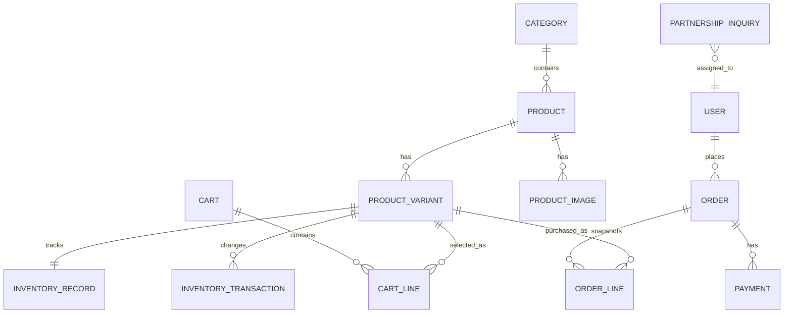

# Phase 0 implementation record

Date: 2026-08-25
Status: complete — technical baseline and owner-approved decisions are recorded.

## What was implemented

| Item | Implementation | Why it belongs in Phase 0 |
| --- | --- | --- |
| Reproducible frontend setup | `npm ci` installs dependencies exclusively from `package-lock.json`; the README documents the local run and verification commands. | A consistent starting point prevents environment-specific defects before backend work starts. |
| Baseline verification | Lint, TypeScript, and production build were run successfully on 2026-08-25. | Phase 1 should start from a known-good frontend, not from unrecorded existing failures. |
| Environment templates | `.env.example` and `backend/.env.example` contain local-only placeholders and are explicitly allowed through `.gitignore`. | Later frontend/backend integration has named configuration from the start, while no secret or production value is committed. |
| CI baseline | `.github/workflows/frontend-checks.yml` runs clean install, lint, type-check, and build on every push and pull request. | The known-good baseline remains enforceable as implementation proceeds. |
| Initial data and API conventions | The conventions below define the contracts that Phase 1 and Phase 2 must follow. | These choices prevent unnecessary migration and API churn once Django models and consumers exist. |

## Baseline results

| Command | Result |
| --- | --- |
| `npm ci` | Passed — 360 packages installed from the lockfile. |
| `npm run lint` | Passed. |
| `npx tsc --noEmit` | Passed. |
| `npm run build` | Passed. The local sandbox initially blocked a helper process from binding a port; the same build passed when run with the required local execution permission. |

No unresolved merge-conflict markers were found in project source or documentation.

## Initial entity relationship diagram

This is a planning diagram only. It documents the intended ownership boundaries; it
does not create Django models before Phase 1.



`ProductVariant` is the purchasable identity. It owns its SKU and price; its
inventory is recorded separately so every stock change can be traced. `OrderLine`
will store immutable product and price snapshots rather than depend on current catalog data.

## API conventions

Phase 1 must expose versioned JSON endpoints below `/api/v1/`.

- Use `snake_case` JSON fields, ISO 8601 UTC datetimes, and decimal strings for money, for example `"unit_price": "850.00"`.
- Public catalog reads are anonymous; all mutations use the minimum required permission.
- Collection endpoints paginate by default and explicitly whitelist filters and ordering fields.
- Validation failures use this stable shape:

  ```json
  {
    "code": "validation_error",
    "detail": "One or more fields are invalid.",
    "fields": { "email": ["Enter a valid email address."] }
  }
  ```

- OpenAPI is the source of truth for public request/response contracts and is validated as part of backend verification when the backend is introduced.

## Accepted owner decisions

The owner approved the following decisions. Their durable records are
[ADR 0001](decisions/0001-initial-product-model-decisions.md) and
[ADR 0002](decisions/0002-initial-platform-services.md).

| Decision | Recommended starting point | Why |
| --- | --- | --- |
| First public release | Catalog and partnership inquiries; defer retail checkout. | It matches the stated first-release focus and lets catalog/API foundations mature before transactional risk is introduced. |
| Price visibility | Publish retail catalog prices in THB; provide wholesale prices only by quote. | It keeps the public catalog useful without prematurely modeling account-specific B2B pricing. |
| Sales region | Thailand only at launch. | Current storefront currency is THB; a single launch region simplifies tax, shipping, and support policies. |
| Coffee options | 250 g, 500 g, and 1 kg; whole bean, espresso, and filter grind where applicable. | These common option values belong on `ProductVariant`, without making every product support every option. |
| Stock policy | Track stock per purchasable variant; do not accept backorders or preorders at launch. | It produces clear availability and audit requirements before checkout is added. |
| B2B quotes | Inquiry-only, with staff-set minimum quantities and account-specific pricing later. | It avoids enforcing commercial rules before they are agreed and tested. |
| Tax, shipping, refunds | Not applicable to the catalog/inquiry launch; B2B terms are quoted by staff. | These must be approved before Phase 4 introduces checkout. |
| Operations providers | Vercel storefront; Render Singapore Django and PostgreSQL; Cloudflare R2 media; Resend transactional email. Payment-provider selection is deferred to Phase 5 evaluation. | The selected services fit the current architecture while avoiding premature payment integration. |

The table records the Phase 0 decision at the time it was accepted. ADR 0007 supersedes
the Cloudflare R2 portion with Supabase Storage during Phase 6; the other provider
decisions remain unchanged.

## Next step

Phase 0 is complete. Phase 1 may now scaffold Django/DRF and PostgreSQL according to
the accepted decisions and API conventions above.
